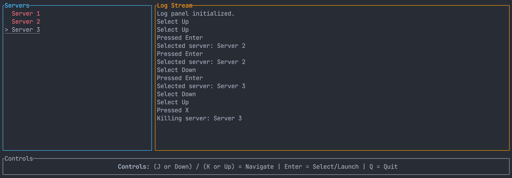
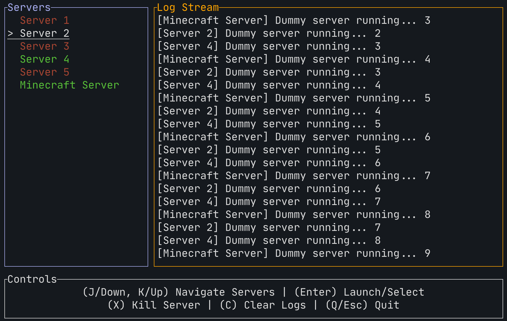

# Server-Launcher
- This is a tool I'm making in preparation for a homelab server rack
- My goal is to be able to ssh into the machine and spin up game servers in a TUI accesable from anywhere
- eventually this will become a mutlipage dashboard

- Im Re-Learning Rust with some small projects

# Features
- resizable and reactive window in terminal

## Plans
- [x] Server Select
- [x] Server Launch
- [x] Dummy tcp localhost streaming
- [ ] Minecraft LAN host
- [ ] CS2 custom map LAN host
- [ ] CS2 multiplayer private host
- [ ] color formatted print per server
- [ ] runtime add server with popup
- [ ] better way to add, manage, load servers

# Progress
Day One

Day Two

